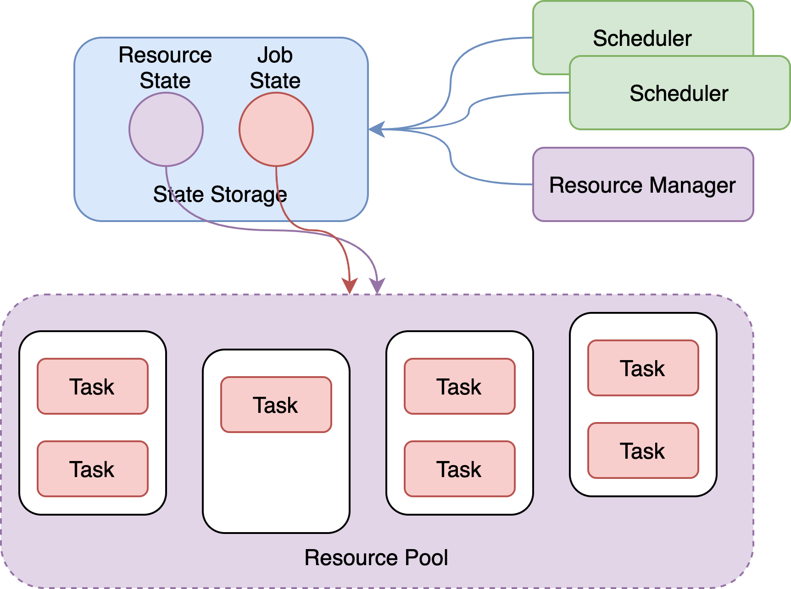
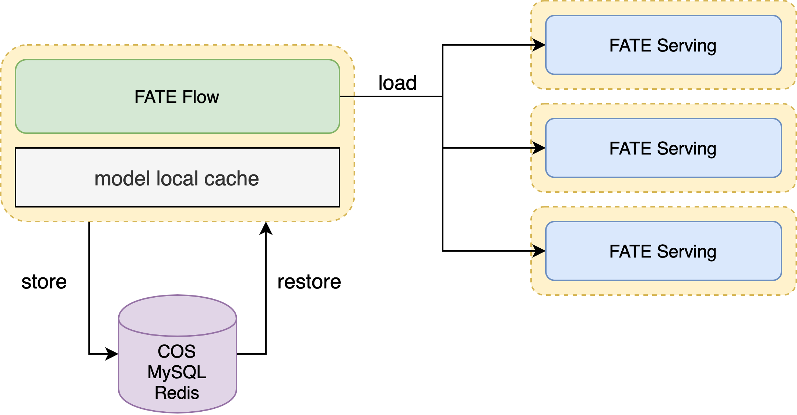

# FATE Flow 整体介绍(待更新)

[TOC]

## 1. 版本历史

| 版本状态 | 创建人     |   完成日期 | 备注 |
| :------- | :--------- | ---------: | :--- |
| 1.0      | jarviszeng | 2021-11-01 | 初始 |

## 2. 逻辑架构

- DSL定义作业
- 自顶向下的纵向子任务流调度、多参与方联合子任务调度
- 独立隔离的任务执行工作进程
- 支持多类型多版本组件
- 计算抽象API
- 存储抽象API
- 跨方传输抽象API

## 3. 整体架构

### 3.1 FATE整体架构

### 3.2 FATE Flow整体架构

## 4. 调度架构

### 4.1 基于共享状态的全新调度架构

- 剥离状态(资源、作业)与管理器(调度器、资源管理器)
- 资源状态与作业状态持久化存于MySQL，全局共享，提供可靠事务性操作
- 提高管理服务的高可用与扩展性
- 作业可介入，支持实现如重启、重跑、并行控制、资源隔离等

### 4.2 状态驱动调度

- 资源协调
- 拉起子进程Executor运行组件
- Executor上报状态到本方Server，并且同时上报到调度方
- 多方任务状态计算联邦任务状态
- 上下游任务状态计算作业作态

## 5. 多方资源协调

- 每个引擎总资源大小通过配置文件配置，后续实现系统对接
- 总资源大小中的cores_per_node表示每个计算节点cpu核数，nodes表示计算节点个数
- FATEFlow server启动时从配置文件读取资源大小配置，并注册更新到数据库
- 以Job维度申请资源，Job Conf提交时生效，公式：task_parallelism*task_cores
- 详细配置讲解： https://github.com/FederatedAI/FATE/blob/master/doc/dsl_conf_v2_setting_guide_zh.rst#4-%E7%B3%BB%E7%BB%9F%E8%BF%90%E8%A1%8C%E5%8F%82%E6%95%B0

## 6. 数据流动追踪

- 定义
 - metric type: 指标类型，如auc, loss, ks等等
 - metric namespace: 自定义指标命名空间，如train, predict
 - metric name: 自定义指标名称，如auc0，hetero_lr_auc0
 - metric data: key-value形式的指标数据
 - metric meta: key-value形式的指标元信息，支持灵活画图
- API
 - log_metric_data(metric_namespace, metric_name, metrics)
 - set_metric_meta(metric_namespace, metric_name, metric_meta)
 - get_metric_data(metric_namespace, metric_name)
 - get_metric_meta(metric_namespace, metric_name)

## 7. 作业实时监测

- 任务执行工作进程
- task executor存活检测
- 作业超时检测
- 资源使用超时检测
- 会话超时检测

## 8. 任务组件中心

## 9. 多方联合模型注册中心

- 使用Google Protocol Buffer作为模型存储协议，利用跨语言共享，每个算法模型由两部分组成：ModelParam & ModelMeta
- 一个Pipeline产生一系列算法模型
- 命名为Pipeline的模型存储Pipeline建模DSL及在线推理DSL
- 联邦学习下，需要保证所有参与方模型一致性，即模型绑定
- model_key为用户提交任务时定义的模型标识
- 联邦各方的模型ID由本方标识信息role、party_id，加model_key
- 联邦各方的模型版本必须唯一且保持一致，FATE-Flow直接设置为job_id

## 10. 多生态数据接入

- Upload：
 - 外部存储直接导入到FATE Storage，创建一个新的DTable
 - 作业运行时，Reader直接从Storage读取

- Table Bind：
 - 外部存储地址关键到FATE一个新的DTable
 - 作业运行时，Reader通过Meta从外部存储读取数据并转存到FATE Storage
 - 打通大数据生态：HDFS，Hive/MySQL

## 11. 多方合作权限管理

